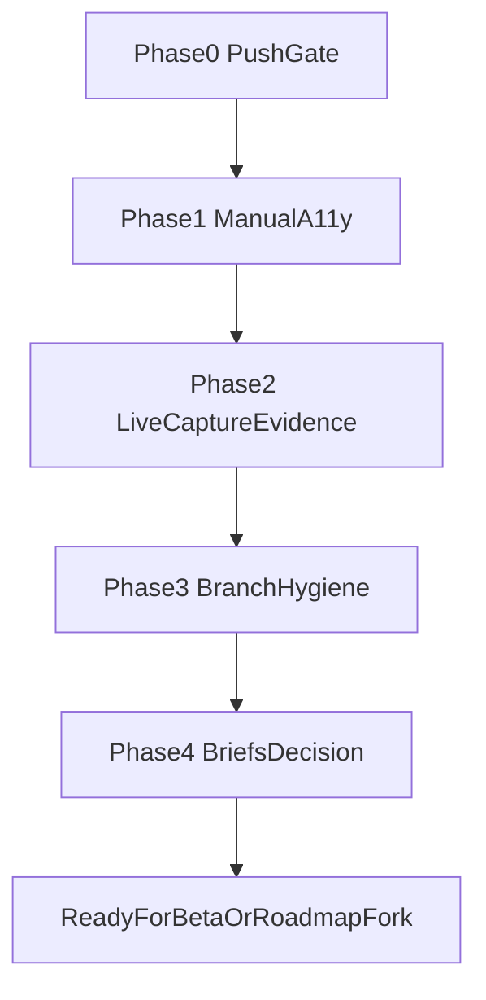

# Post-consolidation next-phase plan

**Date:** 2026-08-29  
**Checkout:** `main` @ `89eef91` (ahead of `origin/main` by 33 commits)  
**Prior work:** SwiftUI hardening + invisible-capture landed locally; report at [`docs/swiftui-hardening-final-report-2026-08-29.md`](swiftui-hardening-final-report-2026-08-29.md).  
**Do not redo:** TrackPlayCount identity, Home ForEach fix, LibrarySelection helper, Settings previews, static a11y family audit, integration merge.

This plan assumes the default next-phase scope: **close the merge safely, then prove capture and accessibility with human/hardware evidence**. Alternate scopes (product briefs roadmap, beta packaging) are listed as forks at the end.

---

## Current truth (verified 2026-08-29)

| Fact | Evidence |
|------|----------|
| Local `main` contains capture + hardening | `89eef91` on `main`; ancestors `ab50dee`, `f1fb105`, merge `3bf2785` |
| Not on origin yet | `main...origin/main [ahead 33]` |
| Briefs still untracked | `?? docs/brief-*.md` only dirty files |
| Automated gates already green on merge | 284 tests / 3 skipped; build; smoke-cli; smoke-app; `git diff --check` |
| Manual a11y unfinished | [`docs/swiftui-manual-a11y-notes-2026-08-29.md`](swiftui-manual-a11y-notes-2026-08-29.md) all rows Pending operator |
| Live capture not merge-proof | `scripts/live-invisible-capture-check.sh`, `scripts/live-hardware-route-check.sh` present; not run as merge gate |
| Experimental lines preserved | `feature/mobile-companion`, `review-audio-driver-proto`, `fix-memory-leaks`, `superset-*` (+ worktrees) |

---

## Phase 0 — Push gate (human approval)

**Goal:** Publish verified local `main` without dragging briefs or experimental branches.

1. Confirm working tree is only untracked briefs (`git status --short`).
2. Re-run once on `main` before push: `swift test`, `swift build`, `bash scripts/smoke-cli.sh`, `bash scripts/smoke-app.sh`, `git diff --check`.
3. **Ask before push.** Then `git push origin main` (no force).
4. Optionally open a PR from an already-pushed integration tag only if remote review is required; local merge already happened.

**Acceptance:** `origin/main` contains `89eef91` (or later report tip); briefs still untracked; no force-push.

**Out of scope:** deleting `cursor/invisible-capture-v1` or `integration/swiftui-hardening-capture`.

---

## Phase 1 — Manual macOS accessibility (operator)

**Goal:** Fill the pending rows in [`docs/swiftui-manual-a11y-notes-2026-08-29.md`](swiftui-manual-a11y-notes-2026-08-29.md).

1. `bash scripts/build-app.sh debug && open .build/DJMemory.app`
2. Walk keyboard focus: sidebar routes → Library search/segment/date → Settings toggles/pickers → Recovery actions → disabled scan controls while scanning.
3. VoiceOver: names/roles for search fields, pickers, empty-state actions, recovery buttons.
4. Update the notes table Status/Notes in place (Pass / Fail + path).
5. Fix **only** confirmed a11y bugs that do not rename existing `accessibilityIdentifier`s. Prefer labels/`accessibilityLabel` / focus order.

**Acceptance:** every checklist row filled; Failures either fixed or filed as issues with IDs; identifiers unchanged.

**Reference screens:** Home, Sidebar, Protection, Capture, Library, Activity, Settings, Onboarding, Recovery (checklist in [`docs/swiftui-visual-review-checklist.md`](swiftui-visual-review-checklist.md)).

---

## Phase 2 — Live capture / hardware evidence (separate from CI)

**Goal:** Produce operator evidence that invisible capture works on a real Mac route—without claiming automated proof.

1. Run with a DJ app actually delivering audio:
   - `bash scripts/live-invisible-capture-check.sh`
   - `bash scripts/live-hardware-route-check.sh` when a hardware/input path is under test
   - Optional: `bash scripts/live-app-audio-check.sh`
2. Record results in a new dated note, e.g. `docs/live-capture-evidence-YYYY-MM-DD.md`:
   - machine / OS / DJ app / route (Process Tap / virtual input / SCK fallback)
   - pass/fail per script
   - artifacts kept local (paths only—no audio in git)
3. Keep M14 VirtualDJ plugin live validation on its own track per [`HANDOFF-CODEX.md`](../HANDOFF-CODEX.md) (Pro license session); do not mark M14 Supported until a real mix archives and matches.

**Acceptance:** evidence doc exists; failures named with next action; no audio/track titles committed.

---

## Phase 3 — Branch and worktree hygiene

**Goal:** Recoverable history without merging WIP into `main`.

| Branch / worktree | Action |
|-------------------|--------|
| `cursor/invisible-capture-v1`, `integration/swiftui-hardening-capture` | Keep until `origin/main` has the merge tip; then optional archive tag, do not force-delete |
| `feature/mobile-companion` | Leave parked; merge only with separate iOS review |
| `review-audio-driver-proto` (+ worktree) | Keep for live driver grading; never auto-merge |
| `fix-memory-leaks` (+ worktree) | Separate investigation; merge only with long-session evidence |
| `superset-*` worktrees | Tooling only; do not touch product `main` |
| `codex/invisible-capture-v1-corrections`, `perf/dsp-vdsp-vectorization` | Diff against `main`; cherry-pick only if still unique |

**Acceptance:** written inventory of “keep / archive / candidate cherry-pick”; no force-reset of foreign worktrees.

---

## Phase 4 — Product briefs decision

**Goal:** Resolve the four untracked briefs without accidental commit during engineering passes.

Files: `docs/brief-brand.md`, `docs/brief-competition-market.md`, `docs/brief-marketing.md`, `docs/brief-product.md`.

Choose one:

- **A. Commit as docs** on a `docs/product-briefs` branch + PR (marketing-owned copy).
- **B. Move out of the git worktree** (Dropbox/Notion) and delete from the repo tree.
- **C. Leave untracked** but add an explicit `.git/info/exclude` (or document in leave-off) so agents stop tripping on them.

**Acceptance:** decision recorded in Notes/leave-off; engineering PRs never stage `brief-*` by accident.

---

## Explicit non-goals (this plan)

- No `@Observable` migration, Liquid Glass, or visual redesign (findings said no blockers).
- No AppModel derived-property caching without hitch evidence.
- No merging mobile-companion / memory-leak / audio-driver / superset into `main` under this plan.
- No claiming live hardware scripts as CI green.

---

## Suggested session prompts

**Push + a11y:**  
“On SetCatcher `main`, re-run the full local gate, then wait for my OK to push. After push, drive the manual a11y checklist and update `docs/swiftui-manual-a11y-notes-2026-08-29.md`.”

**Live capture:**  
“Run live-invisible-capture and live-hardware-route checks with Serato running; write `docs/live-capture-evidence-2026-08-29.md` with route facts only.”

**Briefs:**  
“Propose A/B/C for the four untracked briefs; do not commit them until I pick.”

---

## Forks (separate plans if requested)

1. **Product roadmap** — turn briefs + `HANDOFF.md` / `HANDOFF-2-HOME.md` gaps into Beta 1 feature sequencing (Folder Protection first; Capture honest/partial).
2. **Beta packaging** — `scripts/package-beta.sh`, notarize, `docs/beta-release-checklist.md`.
3. **M14 VDJ plugin** — live Pro-session validation only (`HANDOFF-CODEX.md`).

---

## Plan acceptance (this document)

This plan is complete when:

1. It reflects verified `main` @ `89eef91` and ahead-33 vs origin.  
2. It lists remaining work from the final report without reopening finished hardening.  
3. Each phase has acceptance criteria and clear keep-out rules for experimental branches.  
4. The artifact lives at `docs/plan-post-consolidation-2026-08-29.md`.
